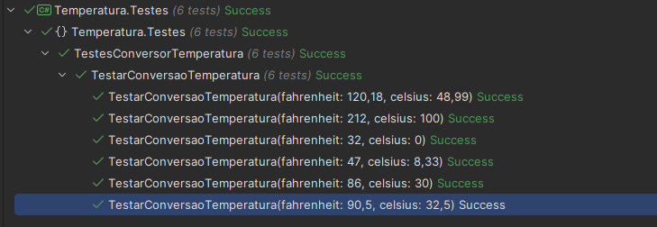
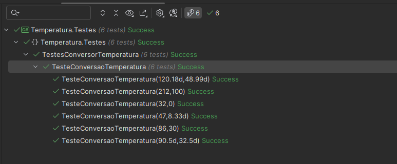
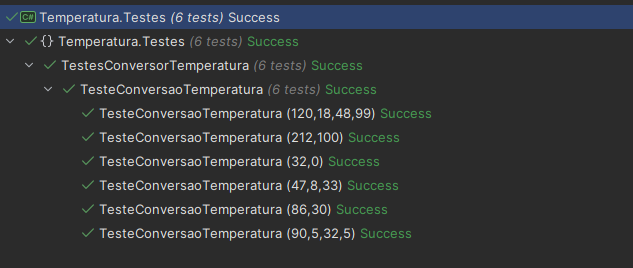

# M10S6-aplicando-testes

Durante esse tutorial, vamos utilizar três frameworks — xUnit, NUnit e MSTest — para realização de testes unitários. Um teste unitário visa testar a menor parte de um código, essa parte é chamada de unidade. Neste tutorial, vamos testar um método que converte temperaturas em Fahrenheit para a equivalente na escala Celsius.

```csharp
using System;

namespace Temperatura
{
    public static class ConversorTemperatura
    {
        public static double FahrenheitParaCelsius(double temperatura)
            => (temperatura - 32) / 1.8; // Simulação de falha
                                         //=> Math.Round((temperatura - 32) / 1.8, 2);
    }
}
```
## Teste com o xUnit

Com o xUnit, utilizamos os atributos Theory e InlineData para a codificação de testes parametrizados.

```csharp
using System;
using Xunit;

namespace Temperatura.Testes
{
    public class TestesConversorTemperatura
    {
        [Theory]
        [InlineData(32, 0)]
        [InlineData(47, 8.33)]
        [InlineData(86, 30)]
        [InlineData(90.5, 32.5)]
        [InlineData(120.18, 48.99)]
        [InlineData(212, 100)]
        public void TestarConversaoTemperatura(
            double fahrenheit, double celsius)
        {
            double valorCalculado =
                ConversorTemperatura.FahrenheitParaCelsius(fahrenheit);
            Assert.Equal(celsius, valorCalculado);
        }
    }
}
```
### Testes rodados


## Teste com o NUnit
Com o NUnit, foi utilizado o atributo TestCase.

```csharp
using NUnit.Framework;

namespace Temperatura.Testes
{
    public class TestesConversorTemperatura
    {
        [TestCase(32, 0)]
        [TestCase(47, 8.33)]
        [TestCase(86, 30)]
        [TestCase(90.5, 32.5)]
        [TestCase(120.18, 48.99)]
        [TestCase(212, 100)]
        public void TesteConversaoTemperatura(
            double tempFahrenheit, double tempCelsius)
        {
            double valorCalculado =
                ConversorTemperatura.FahrenheitParaCelsius(tempFahrenheit);
            Assert.AreEqual(tempCelsius, valorCalculado);
        }
    }
}
```
### Testes rodados


## Teste com o MSTest
Com o MSTest, utilizamos os atributos DataTestMethod e DataRow para chegar a uma codificação similar aos dois exemplos anteriores.

```csharp
using Microsoft.VisualStudio.TestTools.UnitTesting;

namespace Temperatura.Testes
{
    [TestClass]
    public class TestesConversorTemperatura
    {
        [DataRow(32, 0)]
        [DataRow(47, 8.33)]
        [DataRow(86, 30)]
        [DataRow(90.5, 32.5)]
        [DataRow(120.18, 48.99)]
        [DataRow(212, 100)]
        [DataTestMethod]
        public void TesteConversaoTemperatura(
            double tempFahrenheit, double tempCelsius)
        {
            double valorCalculado =
                ConversorTemperatura.FahrenheitParaCelsius(tempFahrenheit);
            Assert.AreEqual(tempCelsius, valorCalculado);
        }
    }
}
```
### Testes rodados



